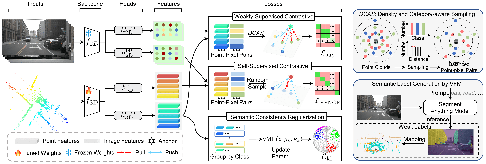

# Fine-grained Image-to-LiDAR Contrastive Distillation with Visual Foundation Models

Official PyTorch implementation of the method **OLIVINE**. More details can be found in the paper:

**Fine-grained Image-to-LiDAR Contrastive Distillation with Visual Foundation Models**, under review. [[arXiv](https://arxiv.org/abs/2405.14271)]




## Dependencies

Please install the required required packages. Some libraries used in this project, including MinkowskiEngine and Pytorch-lightning are known to have a different behavior when using a different version; please use the exact versions specified in `requirements.txt`.


## Datasets

The code provided is compatible with [nuScenes](https://www.nuscenes.org/lidar-segmentation) and [semantic KITTI](http://www.semantic-kitti.org/tasks.html#semseg). Put the datasets you intend to use in the "datasets" folder (a symbolic link is accepted).
```
datasets/
├── nuscenes
    ├── camseg (semantic labels infered by Grounded-SAM)
    ├── lidarseg (decompress nuScenes-lidarseg-all-v1.0.tar)
    ├── maps
    ├── samples
    ├── sweeps
    ├── v1.0-mini
    ├── v1.0-test
    ├── v1.0-trainval
    └── zip_files
└── semantic_kitti
    ├── dataset
        ├── poses
        └── sequences
```

## Pre-trained models
Minkowski SR-UNet pre-trained on nuScenes: [Link](https://drive.google.com/file/d/1gMzwFymKkSi5WqeEL8Ie9L8N6qTcli2u/view?usp=sharing).

<!--
### SPconv VoxelNet
[VoxelNet pre-trained on nuScenes](#) (to release)

[PV-RCNN finetuned on KITTI](#) (to release) -->

## Reproducing the results

### Predict the weak semantic labels (required)

<!-- Before launching the pre-training, you first need to compute all superpixels on nuScenes, this can take several hours. You can either compute superpixels for the Minkowski SR-UNet (minkunet) or the voxelnet backbones. The first is adapted for semantic segmentation and the second for object detection. -->
First we use the [Grounded-SAM](https://github.com/IDEA-Research/Grounded-Segment-Anything) to obtain weak semantic labels of RGB images. To initialize the submodle:

``` git submodule update --init ``` 

Then, the script for the prediction can be found in **Grounded-SAM/infer.sh**. Please install Grounded-SAM following the instructions (see **Grounded-SAM/README.md**) before running the script.

You can also obtain the labels by directly downloading the files we provide in [Baidu netdisk](https://pan.baidu.com/s/1CNQRCawQuL5eNFQqTXMwlw?pwd=1jkr) or [Google Drive](https://drive.google.com/file/d/1FGow9PFoH11M-g_eUg-7ZGZdT_8pUt4j/view?usp=drive_link).

### Pre-training a 3D backbone

To launch a pre-training of the Minkowski SR-UNet (minkunet) on nuScenes:

```python pretrain.py --cfg config/olivine_minkunet.yaml```

You can alternatively replace minkunet with voxelnet to pre-train a PV-RCNN backbone.  
Weights of the pre-training can be found in the output folder, and can be re-used during a downstream task.
If you wish to use multiple GPUs, please scale the learning rate and batch size accordingly.

**TIPs:** The pre-trained weights in the final epoch of pre-training may not always be the best; it's worth considering saving the weights from other rounds, such as the 40th epoch.

### Semantic segmentation

To launch a semantic segmentation, use the following command:

```python downstream.py --cfg_file="config/semseg_nuscenes.yaml" --pretraining_path="output/pretrain/[...]/model.pt"```

with the previously obtained weights, and any config file. The default config will perform a finetuning on 1% of nuScenes' training set, with the learning rates optimized for the provided pre-training.

To re-evaluate the score of any downstream network, run:

```python evaluate.py --resume_path="output/downstream/[...]/model.pt" --dataset="nuscenes"```

If you wish to reevaluate the linear probing, the experiments in the paper were obtained with `lr=0.05`, `lr_head=null` and `freeze_layers=True`.

### Object detection

All experiments for object detection have been done using [OpenPCDet](https://github.com/open-mmlab/OpenPCDet).


## Published results
All results are obtained with weights pre-trained on nuScenes.

### Few-shot semantic segmentation

#### Results on the validation set using Minkowski SR-Unet:
Method                                           |nuScenes<br />lin. probing|nuScenes<br />Finetuning with 1% data|KITTI<br />Finetuning with 1% data
---                                              |:-:                       |:-:                                  |:-:
Random init.                                     |8.1                       |30.3                                 |39.5
[PointContrast](https://arxiv.org/abs/2007.10985)|21.9                      |32.5                                 |41.1
[DepthContrast](https://arxiv.org/abs/2101.02691)|22.1                      |31.7                                 |41.5
[PPKT](https://arxiv.org/abs/2104.04687)         |36.4                      |37.8                                 |43.9
[SLidR](https://arxiv.org/abs/2203.16258)                                            |38.8                  |38.3                             |44.6
OLIVINE                                            |**47.3**                  |**46.1**                             |**47.3**

### Semantic Segmentation on nuScenes

#### Results on the validation set using Minkowski SR-Unet with a fraction of the training labels:
Method          |1%      |5%      |10%     |25%     |100%
---             |:-:     |:-:     |:-:     |:-:     |:-:
Random init.    |30.3    |47.7    |56.6    |64.8    |74.2
SLidR           |  39.0  |  52.2  |  58.8  |  66.2  |  74.6  
OLIVINE           |**46.1**|**57.5**|**63.0**|**69.3**|**76.1**

### Object detection on KITTI

<!-- #### Results on the validation set using Minkowski SR-Unet with a fraction of the training labels:
Method                                  |5%      |10%     |20%     
---                                     |:-:     |:-:     |:-:
Random init.                            |56.1    |59.1    |61.6
[PPKT](https://arxiv.org/abs/2104.04687)|**57.8**|60.1    |61.2
SLidR                                   |**57.8**|**61.4**|**62.4** -->

<!-- ## Unpublished preliminary results -->
All results are obtained with a pre-training on nuScenes.

#### Results on the validation set using [PV-RCNN](https://arxiv.org/abs/1912.13192):
Method                                   |Car     |Pedestrian|Cyclist |mAP@40
---                                      |:-:     |:-:       |:-:     |:-:
Random init.                             |84.5    |57.9      |71.3    |71.3
[STRL](https://arxiv.org/abs/2109.00179)*|84.7    |57.8      |71.9    |71.5
[PPKT](https://arxiv.org/abs/2104.04687) |83.2    |55.5      |73.8    |70.8
[SLidR](https://arxiv.org/abs/2203.16258)|84.4    |57.3      |74.2    |71.9
OLIVINE                                  |84.8    |59.3      |74.2    |**72.8**

*STRL has been pre-trained on KITTI, while SLidR and PPKT were pre-trained on nuScenes

#### Results on the validation set using [SECOND](https://www.mdpi.com/1424-8220/18/10/3337):
Method                                          |Car     |Pedestrian|Cyclist |mAP@40
---                                             |:-:     |:-:       |:-:     |:-:
Random init.                                    |81.5    |50.9      |66.5    |66.3
[DeepCluster](https://arxiv.org/abs/1807.05520)*|        |          |        |66.1
[SLidR](https://arxiv.org/abs/2203.16258)       |81.9    |51.6      |68.5    |67.3
OLIVINE                                         |82.0    |53.2      |69.8    |**68.3**

*As reimplemented in [ONCE](https://arxiv.org/abs/2106.11037)

<!-- ## Visualizations

For visualization you need a pre-training containing both 2D & 3D models. We provide the raw [SR-UNet & ResNet50 pre-trained on nuScenes](https://github.com/valeoai/SLidR/releases/download/v1.1/minkunet_slidr_1gpu_raw.pt).
The image part of the pre-trained weights are identical for almost all layers to those of [MoCov2](https://github.com/facebookresearch/moco) (He et al.)

The [visualization code](utils/visualization.ipynb) allows to assess the similarities between points and pixels, as shown in the article. -->


## Acknowledgment
We implement the method based on [SLidR](https://github.com/valeoai/SLidR).
Part of the codebase has been adapted from [PointContrast](https://github.com/facebookresearch/PointContrast).
Computation of the lovasz loss used in semantic segmentation follows the code of [PolarNet](https://github.com/edwardzhou130/PolarSeg).

## License
OLIVINE is released under the [Apache 2.0 license](./LICENSE).

## Citation
If you use OLIVINE useful in your research, please consider citing:
```
@article{zhang2024fine,
    title={Fine-grained Image-to-LiDAR Contrastive Distillation with Visual Foundation Models},
    author={Zhang, Yifan and Hou, Junhui},
    journal={arXiv preprint arXiv:2405.14271},
    year={2024}
}
```
